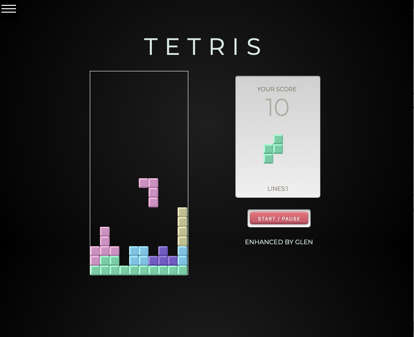

## Table of contents

-   [General info](#general-info)
-   [Link](#tetris-link)
-   [MVP](#MVP)
-   [Future functionality](#future-functionality)
-   [Screenshots](#screenshots)
-   [In-depth Features of Tetris](#in-depth-features-of-tetris)
-   [Challenges](#challenges)
-   [Technologies Used](#technologies-used)
-   [Download](#download)

## General info

This game replicates a basic Tetris game with the standard 7 terominos (shapes) accounted for.

From a developer's point of view, this project was chosen to further enhance DOM manipulation and Javascript knowledge.

## Tetris Link

-   The link to Tetris is:
    [https://mistergjones.github.io/tetris/]

## MVP

The following were the key requirements in meeting the MVP/POC.

-   a player can play a simple chess game with all 7 shapes.
-   the shapes stack when placed correctly and/or incorrectly (i.e. a player moved a shape into the wrong position).
-   when (1,2,3 or 4) continuous blocks are achieved, the game removes these lines.
-   when shapes are at the edges, prevent them from being morped and apperaing on the other side of the grid.
-   a user can START / PAUSE the game.
-   basic score keeping.

## Future Functionality

Future functionality can incorporate the following:

-   Increase the speed of the blocks falling once a certain score or number of lines have been cleared.
-   introduce incremental random lines at the bottom of the game grid once a certain score or number of lines have been cleared.
-   Both options will increase the intensity of the gameplay.

## Screenshots

## In-depth Features of Tetris

-   arrays to store the perumtations of the morphing of each tetromino shape. (i.e. there are always 4 transitions/rotations of each shape)
-   methods to calculate and prevent "bleed over" the side of the far right & left sides if a shape tries to change.
-   DOM manipulation and setIntervals to "draw" the shapes moving down the screen.
-   Implemented keycodes and eventlisteners for game play movement.

## Challenges

-   The biggest challenge was to ensure when attempting to change shapes at each edge, the player is prevented as the shape would "bleed" onto the other side of the grid.

## Technologies Used

Project is created with:

-   Javascript
-   CSS.
-   HTML.
-   Git/Github (for version control).

## Download

Download via:

-   https://github.com/mistergjones/tetris.git
